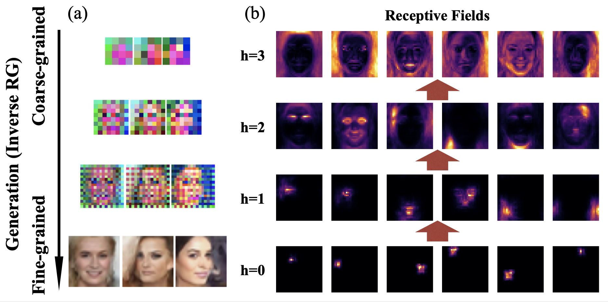
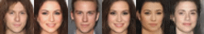
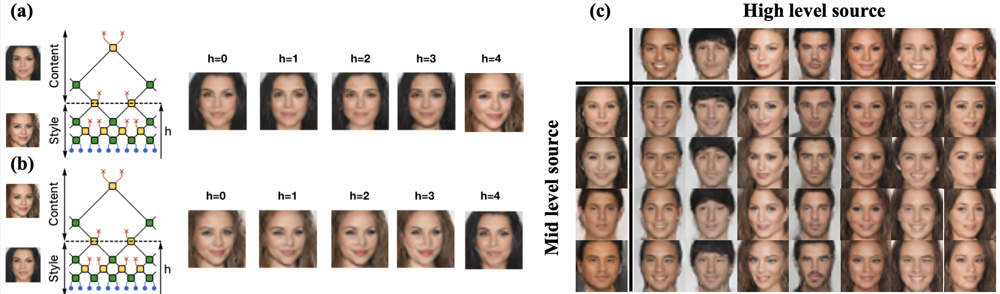

# RG-Flow: a hierarchical and explainable flow model based on renormalization group and sparse prior
Flow-based generative models have become an important class of unsupervised learning approaches. In this work, we incorporate the key idea of *renormalization group* (RG) and *sparse prior distribution* to design a hierarchical flow-based generative model, called **RG-Flow**, which can separate different scale information of images with disentangle representations at each scale.

<!--- ## Flow-based generative models --->

## RG-Flow structure

  

<!--- --->

## Random walk in high level latent representations

  

## Random walk in mid level latent representations

  

## Learned receptive fields

  

## Learned factors

<!--- * High level factors --->

<!--- **Emotion factor** --->

<!--- --->

<!--- **Gender factor**--->

<!--- --->

<!--- **Light projection factor**--->

<!--- --->

<!--- **Azimuth factor**--->

<!--- --->

<!--- * Mid level factors--->

<!--- * Low level factors--->

## Face-mixing in the scaling direction
<!------>

  

