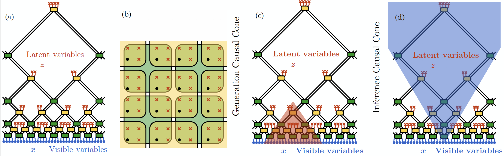
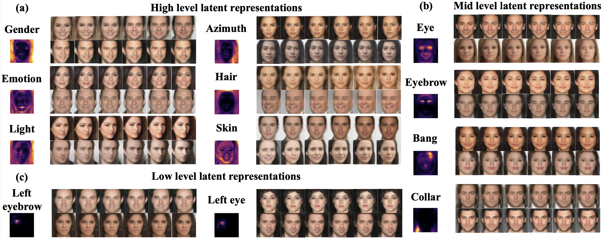

# RG-Flow

This repository contains the code for the paper "RG-Flow: A hierarchical and explainable flow model based on renormalization group and sparse prior" ([arXiv:2010.00029](https://arxiv.org/abs/2010.00029)).

Flow-based generative models have become an important class of unsupervised learning approaches. In this work, we incorporate the key ideas of *renormalization group* (RG) and *sparse prior distribution* to design a hierarchical flow-based generative model, called **RG-Flow**, which can separate different scale information of images with disentangled representations at each scale.

# Dependencies

The code requires `Python >= 3.7` and `PyTorch >= 1.6`, with optional CUDA support. Other dependencies can be installed via
```sh
pip install -r requirements.txt
```

# Gallery

## RG-Flow structure

<p align="center">
  
</p>

## Random walk in high-level latent representations

<p align="center">
  
</p>

## Random walk in mid-level latent representations

<p align="center">
  
</p>

## Learned receptive fields

<p align="center">
  
</p>

## Learned factors



### High-level factor: emotion


### High-level factor: gender


### High-level factor: light direction


### High-level factor: rotation


### High-level factor: hair color


### Mid-level factor: eyebrows


### Mid-level factor: eyes


## Face mixing in the scaling direction

<p align="center">
  
</p>

# Running experiments

`main.py` is the code for training the network. All adjustable arguments are stored in `args.py`, together with their default values when we were training on the CelebA dataset. They can be displayed via `python main.py --help`:
```
usage: main.py [-h] [--data {celeba32,mnist32,cifar10,chair600,msds1,msds2}] [--data_path DATA_PATH]
               [--nchannels NCHANNELS] [--L L] [--prior {gaussian,laplace}] [--subnet {rnvp,ar}]
               [--kernel_size KERNEL_SIZE] [--nlayers NLAYERS] [--nresblocks NRESBLOCKS]
               [--nmlp NMLP] [--nhidden NHIDDEN] [--dtype {float32,float64}]
               [--batch_size BATCH_SIZE] [--lr LR] [--weight_decay WEIGHT_DECAY] [--epoch EPOCH]
               [--clip_grad CLIP_GRAD] [--no_stdout] [--print_step PRINT_STEP]
               [--save_epoch SAVE_EPOCH] [--keep_epoch KEEP_EPOCH] [--plot_epoch PLOT_EPOCH]
               [--cuda CUDA] [--out_infix OUT_INFIX] [-o OUT_DIR]

options:
  -h, --help            show this help message and exit

dataset parameters:
  --data {celeba32,mnist32,cifar10,chair600,msds1,msds2}
                        dataset name
  --data_path DATA_PATH
                        dataset path
  --nchannels NCHANNELS
                        number of channels
  --L L                 edge length of images

network parameters:
  --prior {gaussian,laplace}
                        prior of latent variables
  --subnet {rnvp,ar}    type of subnet in an RG block
  --kernel_size KERNEL_SIZE
                        edge length of an RG block
  --nlayers NLAYERS     number of subnet layers in an RG block
  --nresblocks NRESBLOCKS
                        number of residual blocks in a subnet layer
  --nmlp NMLP           number of MLP hidden layers in an residual block
  --nhidden NHIDDEN     width of MLP hidden layers
  --dtype {float32,float64}
                        dtype

optimizer parameters:
  --batch_size BATCH_SIZE
                        batch size
  --lr LR               learning rate
  --weight_decay WEIGHT_DECAY
                        weight decay
  --epoch EPOCH         number of epoches
  --clip_grad CLIP_GRAD
                        global norm to clip gradients, 0 for disabled

system parameters:
  --no_stdout           do not print log to stdout, for better performance
  --print_step PRINT_STEP
                        number of batches to print log, 0 for disabled
  --save_epoch SAVE_EPOCH
                        number of epochs to save network weights, 0 for disabled
  --keep_epoch KEEP_EPOCH
                        number of epochs to keep saved network weights, 0 for disabled
  --plot_epoch PLOT_EPOCH
                        number of epochs to plot samples, 0 for disabled
  --cuda CUDA           IDs of GPUs to use, empty for disabled
  --out_infix OUT_INFIX
                        infix in output filename to distinguish repeated runs
  -o OUT_DIR, --out_dir OUT_DIR
                        directory for output, empty for disabled
```

During training, the log file and the network weights will be saved in `out_dir`.

After the network is trained, `plot_mix_temperature.py` can be used to plot samples using mixed effective temperatures, described in Appendix B of the paper.

# Citation

```
@article{hu2020rg,
title={RG-Flow: A hierarchical and explainable flow model based on renormalization group and sparse prior},
author={Hu, Hong-Ye and Wu, Dian and You, Yi-Zhuang and Olshausen, Bruno and Chen, Yubei},
journal={arXiv preprint arXiv:2010.00029},
year={2020}
}
```
