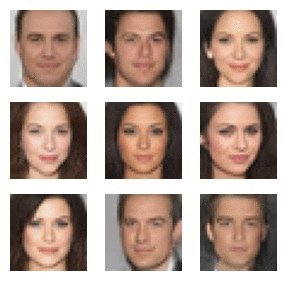

# RG-Flow: A hierarchical and explainable flow models based on renormalization group and sparse prior
In this project, we explore utilizing the idea of *renormalization group* in designing a flow based generative model

## Flow-based generative models

## RG-Flow structure

## Learned eceptive fields

## Learned factors

### High level factors

#### Emotion factor

### Mid level factors

## Face-mixing in hyperbolic space

## Inpainting and error correction
